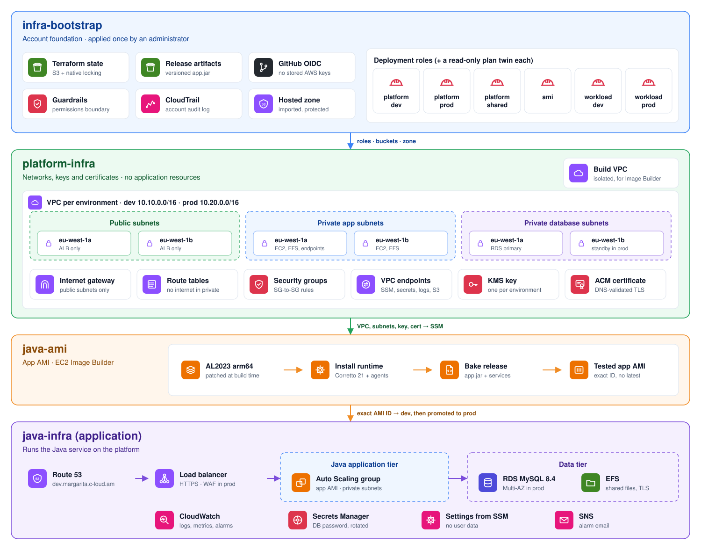

# Java Platform on AWS

A Java service on AWS, built entirely as code and delivered through GitHub Actions, following the
AWS Well-Architected Framework. The platform is split into four repositories, one per layer, each
with its own pipeline, its own AWS role and its own Terraform state.

<picture>
  <source media="(prefers-color-scheme: dark)" srcset="docs/diagrams/overview.dark.svg">
  
</picture>

## Repositories

| Layer | Repository | What it builds |
|---|---|---|
| 1 | [**infra-bootstrap**](https://github.com/maga-zargaryan/infra-bootstrap) | Terraform state, GitHub OIDC with one least-privilege role per repo and environment, permissions boundary, CloudTrail, account baseline, GitHub settings as code |
| 2 | [**platform-infra**](https://github.com/maga-zargaryan/platform-infra) | Three-tier VPCs across two AZs with no NAT, VPC endpoints, flow logs, a KMS key per environment, ACM certificates, an isolated Image Builder VPC |
| 3 | [**java-ami**](https://github.com/maga-zargaryan/java-ami) | Fully immutable Graviton app AMI built by EC2 Image Builder: patched Amazon Linux 2023, Corretto 21 and the application release, tested before use |
| 4 | [**java-infra**](https://github.com/maga-zargaryan/java-infra) | The application tier: Route 53, ALB with WAF, Auto Scaling with rolling refresh, RDS MySQL, EFS, alarms |

Layers hand values to each other only through **SSM Parameter Store** (VPC IDs, subnets, keys,
certificates, the AMI ID), never by reading another layer's Terraform state.

## Highlights

- **No long-lived credentials in CI.** Each job exchanges a GitHub OIDC token for a 1-hour role, pinned to the repository's immutable ID and GitHub Environment. Pull requests only get read-only roles.
- **Guardrails.** Pipelines can only create IAM roles under their own prefix and only with a permissions boundary attached.
- **Private by default.** No NAT gateway and no internet route from private subnets; AWS services are reached through VPC endpoints; security groups allow exactly one path per flow.
- **Encryption everywhere.** Customer-managed KMS keys for EBS, RDS, EFS, logs and SNS; TLS 1.3 at the load balancer, TLS required by MySQL and EFS.
- **Fully immutable instances.** Each AMI contains the patched OS, Java and one application release, and is tested before use. Instances have no user data: a configurator baked into the image reads the environment's settings from SSM at boot.
- **Safe releases.** A release is a new AMI rolled out with health checks and automatic rollback; the JAR is checksum-verified when baked.
- **Reviewed changes only.** Branch protection, plans on every pull request, and production applies exactly the plan that was approved.

## Delivery

<picture>
  <source media="(prefers-color-scheme: dark)" srcset="docs/diagrams/delivery.dark.svg">
  
</picture>

## More diagrams

| Diagram | Shows |
|---|---|
| [CI identity](docs/diagrams/identity.light.svg) | How a workflow gets AWS access through OIDC, and the GitHub controls managed as code |
| [Network](docs/diagrams/network.light.svg) | Subnet tiers per AZ, private access to AWS services, the isolated build VPC |
| [Image pipeline](docs/diagrams/image-pipeline.light.svg) | Build, test and publish steps of the app AMI |
| [Application tier](docs/diagrams/workload.light.svg) | Request path, security-group chain, instance boot steps, observability |

## Deploy order

1. `infra-bootstrap`: applied once by an administrator (it creates the roles CI uses)
2. `platform-infra`: shared build network, then dev, then prod after approval
3. Upload an application release to the artifacts bucket
4. `java-ami`: build the app AMI with that release
5. `java-infra`: dev, then prod after approval

Teardown runs in reverse order through each repository's `destroy` workflow.

## Well-Architected at a glance

| Pillar | Examples |
|---|---|
| Security | OIDC, least-privilege roles, permissions boundary, private subnets, KMS, TLS, IMDSv2, CloudTrail, WAF |
| Reliability | Two AZs, Multi-AZ RDS in prod, self-healing Auto Scaling, rolling refresh with rollback, backups |
| Operational excellence | Everything as code (GitHub settings included), plans on PRs, alarms, repeatable teardown |
| Performance efficiency | Graviton, gp3, EFS Elastic throughput, CPU target tracking |
| Cost optimization | No NAT, free S3 gateway endpoint, reduced redundancy in dev, lifecycle policies, production switch |

## Diagrams are code

All diagrams are generated by [`tools/diagrams`](tools/diagrams) (Python, no dependencies) in a
light and a dark variant.
